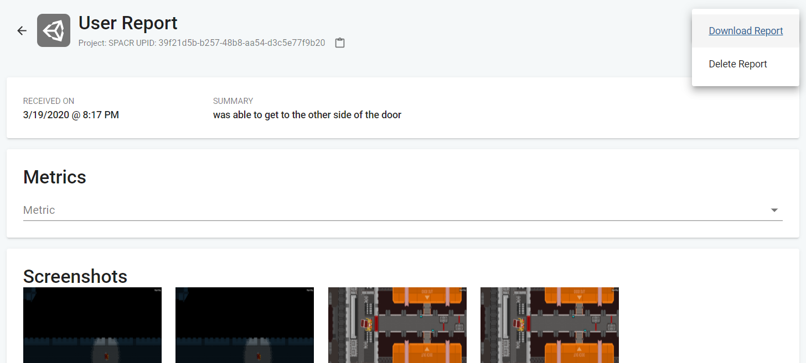

# UnityReportUnpacker
Unpack Unity User Report downloaded as .json into separate files.

**Howto:**

- go to Unity Cloud User Report, open a report detail
- click `Report Actions > Download Report`
- will produce a JSON containing base64 encoded screenshots and other attachments
- put the JSON file (or multiple of them) in the same file as this project
- run `run.bat` with .NET installed
- will produce a new folder for each JSON file, containing all its content (screenshots etc) unpacked

From this:

To this:

Using JSON.net by https://www.newtonsoft.com/json
